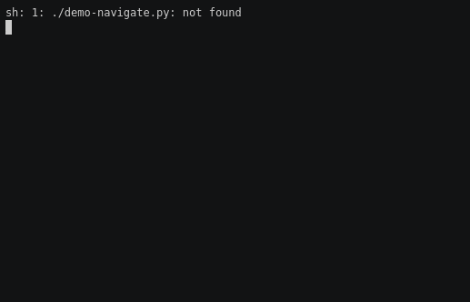

[](https://github.com/lpenz/tuzue/actions/workflows/ci.yml)
[](https://coveralls.io/github/lpenz/tuzue?branch=main)
[](https://tuzue.readthedocs.io/en/latest/?badge=latest)
[](https://pypi.org/project/tuzue/)

# tuzue

Fuzzy-filtering menu-based interactive curses interface for python,
plus utilities.


## Library usage

Basic usage of the library is very simple:

```python
import tuzue

fruits = [ "avocado", "berry", "cherry", "durian", "eggfruit" ]
favorite = tuzue.navigate(fruits, "What is your favorite fruit?")
print("Your favorite fruit is", favorite)
```

That generates the following possible interaction:

[](https://github.com/lpenz/tuzue/raw/main/demos/demo-navigate.gif)


## Inspecting in pdb

tuzue is very useful to inspect object trees in [pdb], like so:

```python
(Pdb) import tuzue
(Pdb) tuzue.inspect( ... )
```

Example session where we use tuzue to inspect itself:

[](https://github.com/lpenz/tuzue/raw/main/demos/demo-pdb.gif)


[pdb]: https://docs.python.org/3/library/pdb.html
