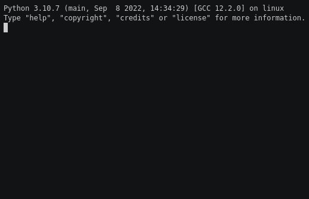

.. tuzue documentation master file, created by
   sphinx-quickstart on Sun Sep 25 17:14:21 2022.
   You can adapt this file completely to your liking, but it should at least
   contain the root `toctree` directive.

Welcome to tuzue's documentation!
=================================

*tuzue* is a fuzzy-filtering menu-based interactive curses interface
for python, with several utilities included as examples.

Basic usage of the library is very simple:

.. code-block:: python

    import tuzue
    
    fruits = [ "avocado", "berry", "cherry", "durian", "eggfruit" ]
    favorite = tuzue.navigate(fruits, "What is your favorite fruit?")

That generates the following possible interaction:

.. toctree::
   :maxdepth: 4
   :caption: Contents:

   modules

Indices and tables
------------------

* :ref:`genindex`
* :ref:`modindex`
* :ref:`search`
